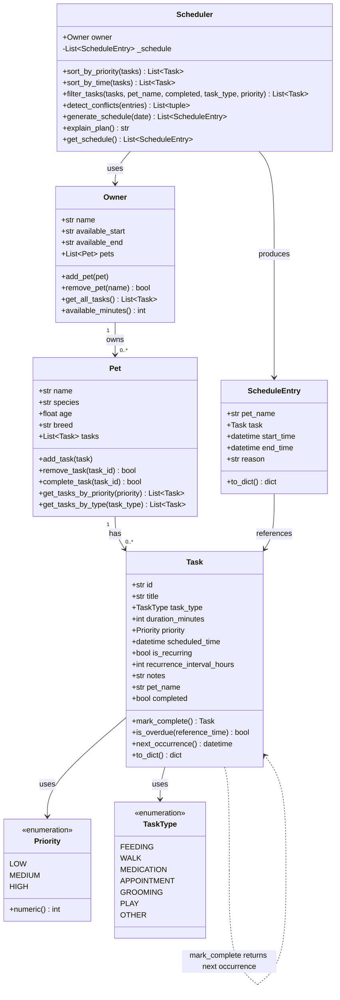

# PawPal+ — Final UML Class Diagram

Paste the Mermaid code below into https://mermaid.live to render the diagram.

## Changes from Phase 1 skeleton

| Change | Reason |
|---|---|
| Added `id: str` to `Task` | Reliable removal by UUID instead of fragile title-matching |
| Added `pet_name: str` to `Task` | Stamped by `Pet.add_task()` so Scheduler can label entries without back-reference |
| Added `completed: bool` to `Task` | Needed for filter logic and overdue detection |
| `mark_complete()` now returns `Task` (nullable) | Enables recurring auto-spawn pattern |
| Added `Pet.complete_task(id)` | Encapsulates "mark done + spawn next" in one atomic operation |
| Added `ScheduleEntry` dataclass | Replaces untyped `dict`; typed contract for schedule consumers |
| Added `Scheduler.sort_by_time()` | Separate sort key from priority sort |
| Added `Scheduler.filter_tasks()` | Multi-criteria AND filter used in Tasks tab |
| `detect_conflicts()` operates on `ScheduleEntry` not `Task` | Conflicts only make sense post-placement when times are concrete |
| Added `ScheduleEntry.to_dict()` | Streamlit-friendly serialisation |
